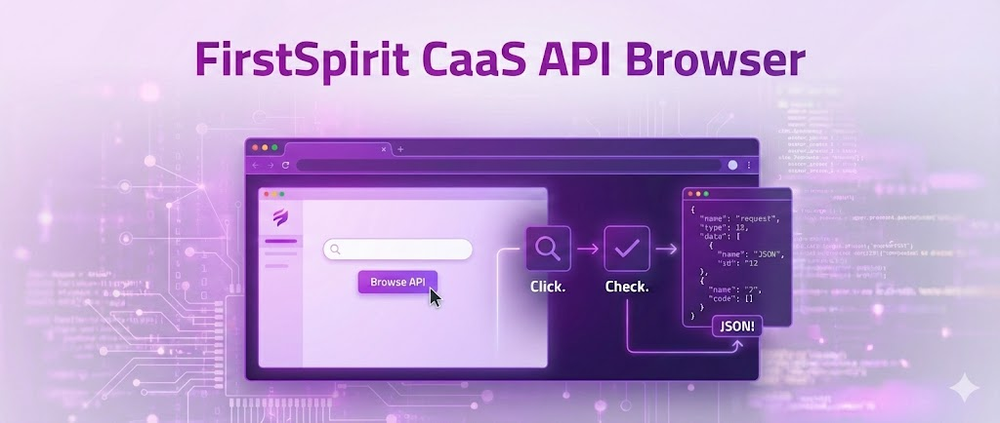

# FirstSpirit CaaS API Browser

A beginner-friendly web interface for exploring and interacting with the FirstSpirit CaaS API. This tool provides an intuitive UI approach to browse, test, and understand CaaS API endpoints without the need of deep technical knowledge.

## Getting Started

### Prerequisites

- Node.js 24 (LTS) or higher, as specified in `.nvmrc` and `package.json`
- Access to a FirstSpirit CaaS API endpoint

### Installation

1. Clone the repository:

```bash
git clone git@github.com:e-Spirit-Usergroup/firstspirit-caas-api-browser.git
cd firstspirit-caas-api-browser
```

2. Install dependencies:

```bash
npm install
```

3. Start the development server:

```bash
npm run dev
```

4. Open your browser and navigate to `http://localhost:5173`

### Build & Deploy

Build for production:

```bash
npm run build
```

The output is a static site in `dist/`. Preview the production build locally:

```bash
npm run preview
```

Deploy by serving the `dist/` folder with any static file server (Nginx, Apache, Caddy, Vercel, Netlify, etc.).

## Configuration

The application stores its configuration in the browser's localStorage. You can configure your project through the setup wizard or by uploading a JSON configuration file.

Configurations can be exported and imported as encrypted JSON files via the **Manage Projects** dialog. API keys are encrypted with AES-GCM using a password you provide during export.

**Security note:** API keys are currently stored in plaintext in localStorage. Only use this tool on trusted devices. Exported configuration files encrypt the API keys, but the keys remain unencrypted in the browser's localStorage while the application is in use.

## Project Structure

```
src/
├── components/     UI and feature components (Radix UI / shadcn-style)
├── lib/            Business logic (CaaS requests, config, crypto)
├── routes/         TanStack Router file-based routes
├── stores/         Zustand persisted stores
├── types/          Shared TypeScript types
public/
└── locales/        i18n translation files (en, de, it)
```

## Code Quality

This project uses [Biome](https://biomejs.dev/) for formatting, linting, and import organization.

```bash
npm run lint:format    # auto-fix lint and formatting issues
```

## Tech Stack

- **Runtime:** React 19, TypeScript 5.9
- **Build:** Vite 8
- **Routing:** TanStack Router (file-based, auto code-splitting)
- **State:** Zustand (persisted to localStorage)
- **Styling:** Tailwind CSS 4, Radix UI primitives
- **Forms:** React Hook Form + Zod
- **i18n:** i18next (English, German, Italian)

## Core Authors & Maintainers

**Kevin Rieger** - [k.rieger@reply.de](mailto:k.rieger@reply.de) - [Neo Reply](https://neoreply.de)

**Felix Kratz** - [f.kratz@reply.de](mailto:f.kratz@reply.de) - [Neo Reply](https://neoreply.de)

## License

This project is licensed under the GNU General Public License v3.0 - see the [LICENSE](LICENSE) file for details.

Copyright (c) 2026 Neo Reply